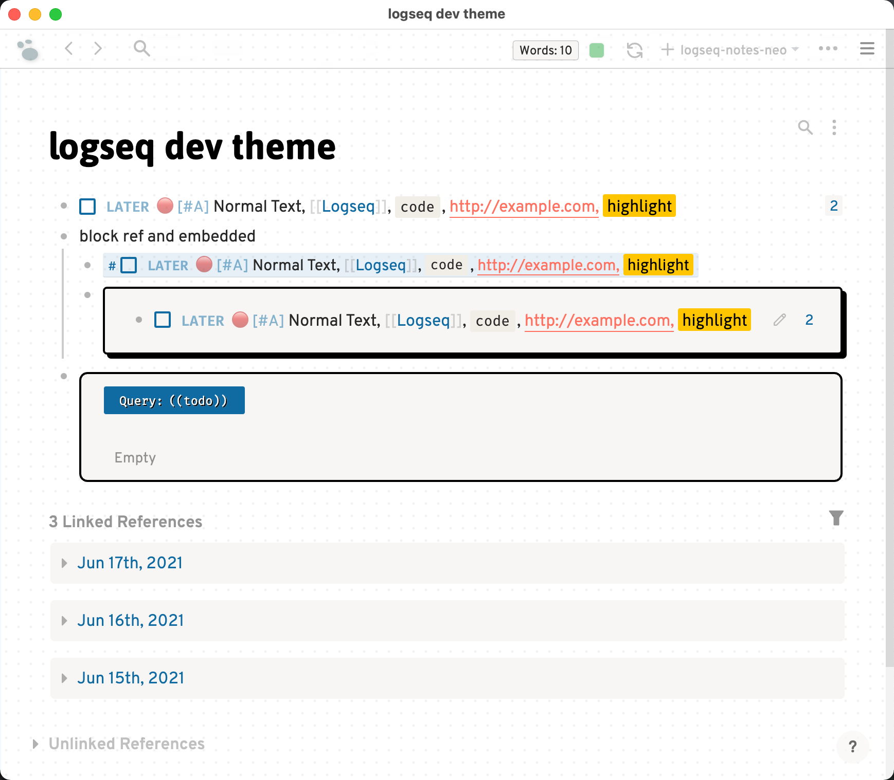
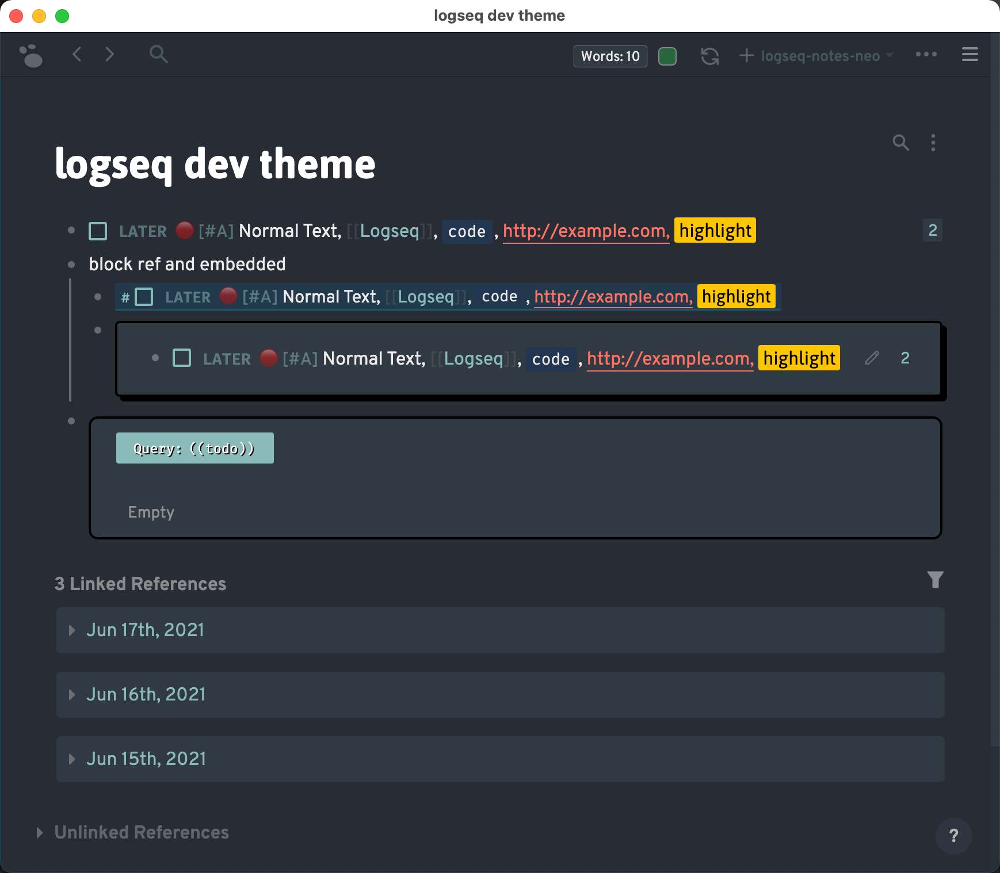

# Logseq Dev Theme

A theme inspired by Dev.to & Figma.

## Working Demo

https://knowledge-garden.vercel.app/

## Usage

The easiest way to adopt this theme is to use jsDelivr CDN by adding the following line to your `custom.css`. You can also change the `@master` part to use the latest version.

```css
@import url("https://cdn.jsdelivr.net/gh/pengx17/logseq-dev-theme@master/custom.css");
```

Alternatively, you can download this repo and load it as a Logseq Theme Plugin.

### demo (might be outdated)





### [Changelog](./CHANGELOG.md)

## Credits

[PiotrSss](https://github.com/PiotrSss) for his [clean-themes](https://github.com/PiotrSss/logseq-clean-themes)
