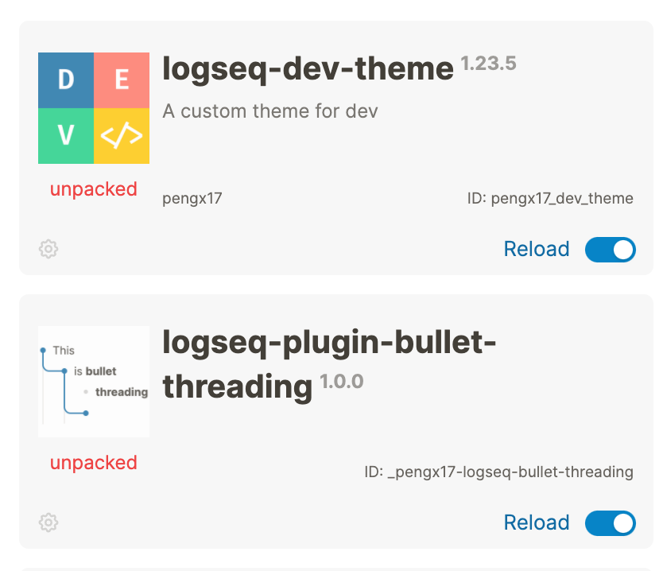
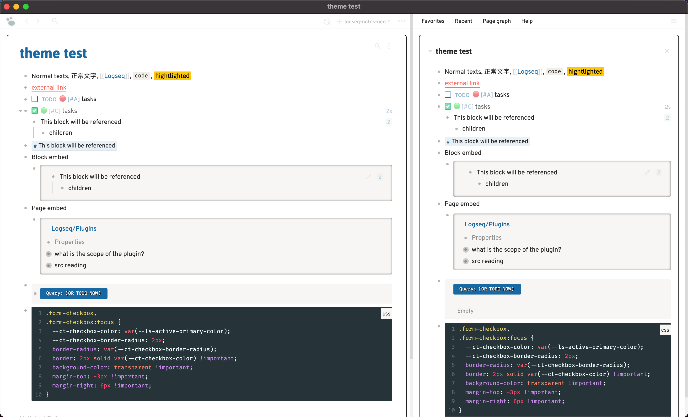

# Logseq Dev Theme

A theme inspired by Dev.to & Figma.


This theme is actively maintained and used on a daily basis by the author. It should have the best UX on macOS.

Features:
- providing bullet threading for editing blocks (also available as [a standalone plugin](https://github.com/pengx17/logseq-plugin-bullet-threading))
- elegant font choices
- delightful colors for markers

## Working Demo

Check out my published knowledge garden at https://pengx17.github.io/knowledge-garden/. Though since the graph is read-only, you cannot test the bullet threading feature with it.

## Usage

### Marketplace
This theme and bullet threading is available in the Marketplace.



### Using custom.css

Another way to adopt this theme is to use jsDelivr CDN by adding the following line to your `custom.css`. You can also change the `@main` part to use the latest version. This is the ONLY way to stylish your published graph for now.

```css
/* This must be the first line of the custom.css with other import rules */
@import url("https://cdn.jsdelivr.net/gh/pengx17/logseq-dev-theme@main/custom.css");

/* You can also add other styles below to override the default theme values */
```

## Customization

This theme does not provide official customization options. However, you can still change most of the colors and fonts. Please take a look [this issue for guidance](https://github.com/pengx17/logseq-dev-theme/issues/46).

## Caveats

- If your theme defines border colors for the `children-block`, the bullet threading css may not work as expected.
- This theme is guaranteed to work with the latest Logseq version WITHOUT backward compability.

## Demo (might be outdated)



https://user-images.githubusercontent.com/584378/128587194-bd775264-b3ba-4303-8595-060953fe8030.mp4


## Changelog

You may refer to [Changelog](./CHANGELOG.md), but it might not be well organized.

## Credits

[PiotrSss](https://github.com/PiotrSss) for his [clean-themes](https://github.com/PiotrSss/logseq-clean-themes)
